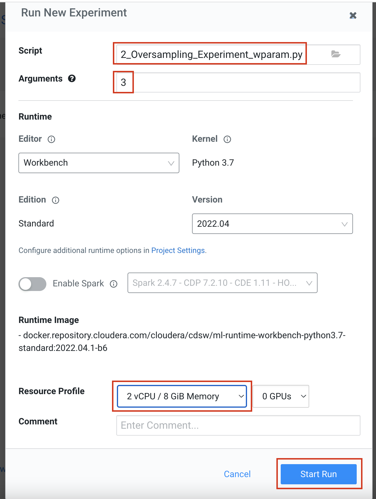

# Credit Scoring with PySpark ML

## Project Summary

This tutorial demonstrates how you can develop a Credit Scoring Model with PySpark. The model is used to score customers at scale via Batch Scoring and REST API. 

The tutorial is divided into the following parts:

1. Exploring the data via PySpark
2. Experimenting with Oversampling at scale (this part of the demo will soon be recreated as soon as ML Flow is added to CML)
3. Creating a SparkML Pipeline with training data
4. Scoring customers in batch with CML Jobs
5. Scoring customers in near-real time via a REST API


## Prerequisites

This project requires access to a CML Workspace or a CDSW Cluster. CML could either be in CDP Public or Private Cloud. 

Some familiarity with Python, PySpark, general API concepts in general and Jupyter Notebooks is recommended. 
However, no coding is required beyond simply executing the provided notebooks.

If you are completely new to CML and would like a quick intro to creating Projects, Sessions, using Spark and more, 
please start with [this repository](https://github.com/pdefusco/CML_CrashCourse)


## CML Project Setup

Navigate to the CDP Management Console and open your environment.


In the next page, take note of the region. For example, in the screenshot below this is ```“us-east-2”```. 
Save this to your editor, you will need this later.

Navigate to your CML Workspace and create a new project as shown below. 


Select the Git Option and paste the following URL:

```https://github.com/pdefusco/Credit_Scoring_SparkML.git```

There is no need to customize the Runtime Setup settings at the bottom of the page. Default option values are fine. 

Within the project, launch a CML Session with the following settings:

~~~
Session Name: Setup Session (anything is fine here)
Editor: Workbench
Kernel: Python 3.7 or above
Enable Spark: disabled
Resource Profile: 2 vCPU / 4 GiB Memory - 0 GPUs
Other settings: default values are fine.
~~~


Next, open script ```“0_Setup.py”``` and hit the play button at the top of the screen to run all code at once. 


This script will print the Cloud Storage environment variable to the screen, download all data for the tutorial, and move it from the local /home/cdsw folder to a new Cloud Storage folder.

This works for both AWS and Azure without edits.

Finally, go back to CML and kill your current Workbench Editor session. You won’t need it anymore.


## Part 1: Data Exploration with PySpark

Navigate back to the CML Project home. Launch a new session with the following settings:

~~~
Session Name: “JupyterLab Session”
Editor: JupyterLab
Kernel: Python 3.7 or higher
Enable Spark: Select a Spark 3.1+ Add-On
Resource Profile: 2 vCPU / 4 GiB Mem - No GPUs required.
Other options: you can leave the remaining options such as Edition and Version to their default values. 
~~~


On the left, double click on the "1_Data_Exploration.ipynb" notebook to open it. You will execute the code in each cell to familiarize yourself with the data.

The notebook includes instructions and comments that explain what each part of the code. No code changes are required. Just execute each cell by either pressing the "play button" at the top, or highlighting it and entering "Shift" + "Enter" on your keyboard. Notice each cell requires a bit of time to run.


## Part 2: Oversampling Experiments with PySpark

With the same CML Session, open the "2_Oversampling.ipynb" notebook and run the cells. Again, no code changes are required.

Random oversampling involves randomly selecting examples from the minority class, with replacement, and adding them to the training dataset. It's particularly useful when the target class is heavily imbalanced. 
Training a model on such data can easily lead to falsely accurate classifiers. Evening out class imbalance can therfore improve the overall quality of your model. However, finding the right oversampling technique can be cumbersome and time consuming as it requires potentially testing many hyperparameter combinations.

As data scientists iteratively develop models, they often experiment with datasets, features, libraries, algorithms, and parameters. Even small changes can significantly impact the resulting model. This means data scientists need the ability to iterate and repeat similar experiments in parallel and on demand, as they rely on differences in output and scores to tune parameters until they obtain the best fit for the problem at hand. Such a training workflow requires versioning of the file system, input parameters, and output of each training run.

Cloudera Machine Learning Experiments facilitate ad-hoc batch execution and model training. Experiments are batch executed workloads where the code, input parameters, and output artifacts are versioned. This feature also provides a lightweight ability to track output data, including files, metrics, and metadata for comparison.

Navigate to the project home folder and open the "2_Oversampling_Experiment_wparam.py" script. Familiarize yourself with the code. Notice it is nearly identical to the code you saw in the notebook, with an exception: at line 175 we have a hyperaparameter k. This is an input to the Oversampling algorithm and it can vary. You can use CML Experiments to submit multiple versions of this parameter in bulk, thus saving yourself a lot of time. 

Then open the Experiments tab and click on "New Experiment" as shown below. 


Submit a new experiments with the following parameters. Leave the Spark Add-On unchecked as shoen below. 

~~~
Script: "2_Oversampling_Experiment_wparam.py" 
Argument: 3
Kernel: Python 3.7 or higher
Enable Spark: Off
Resource Profile: 2 vCPU / 4 GiB Mem - No GPUs required.
Other options: you can leave the remaining options such as Edition and Version to their default values. 
~~~



Notice a new entry will appear in the Experiments UI. This experiment is automatically deployed into a container for you. Once it reaches the "running" status, notice it will fail shortly after. 

Let's investigate why: open the Experiment by clicking on its run ID.


Then open the Sessions tab and scroll down until you see the error. 


NB: In the Summer of 2022 the Experiments feature will be redesigned with the introduction of a native implementation of ML Flow. 


## Part 3: Building a Classifier with SparkML

Open your Jupyter Lab session again and the "3_Classifier_Prototype.ipynb" notebook. Instructions are containted within this notebook and you just need to execute all cells as you've done before.

In summary, this notebook shows how to create a SparkML Pipeline to classify loan applicants with a value of 0 and 1. Loan applicants assigned a 0 should not be offered a loan while the others should be offered one.
Optionally, depending on which classifier you use, you can also output a probability score. A probability score is a number between 0 and 1 and adds a little more detail to the above classification as it allows to assess how likely it will be a that a given loan applicant will default. 

The value can be used as a percentage score. Generally, classifiers default to a threshold of 50% meaning applicants with a 49% score and below will be assigned to class 0 and applicants with a score of 50% and above will be assigned to class 1.
However, you can change this threshold at will and make your loan approvals or denials more or less restrictive. Of course, with CML you could build a financial analysis quantifying the risk of moving the needle up in each direction.

The classifier is saved to cloud storage for easy portability between notebook, projects, and environments.


## Part 4: Score New Loan Applicants in Batch via CML Jobs

You can use CML Jobs to schedule and orchestrate scripts within CML. Just like CML Sessions and Experiments, Jobs allow you to containerize and isolate your workloads without stealing resources from your colleagues.

In addition, CML Jobs allow you to set recurring schedules, alerts, and conditional execution based on success or failure of previous jobs. 

Navigate to the CML Jobs interface from the CML Project landing page. Create a new Job.


Select the following configurations:

~~~
Script: "4_Batch_Scoring.py" 
Kernel: Python 3.7 or higher
Enable Spark: Spark 3.1 or higher
Resource Profile: 2 vCPU / 4 GiB Mem - No GPUs required.
Other options: you can leave the remaining options such as Edition and Version to their default values. 
~~~


Next, create the job. Notice that because this is a manual (not scheduled) job, you will need to trigger it from the CML Jobs landing page.


Trigger the job and observe it while it runs. When it's finished, open the History and then Session tabs to validate code execution.
As you did earlier with CML Experiments, you can use these tabs to troubleshoot and monitor your jobs in the event of an error. 

For example, in the following screenshot you can see a CML Job that failed because OneHotEncoding is deprecated in Spark 3.


## Part 5: Score New Loan Applicants in a REST Endpoint via CML Models

Batch scoring is a great way to assign a credit score or other values to large numbers of loan applicants in bulk. However, the downside is that it requires waiting for the jobs to execute, which could take a while.

With CML Models you can wrap a model into a REST Endpoint so it is reachable via an API request. As with CML Sessions, Experiments, and Jobs the CML Model is deployed in an isolated container for you. Unlike the other CML features you've tested so far, CML Models provide a number of tools to version, monitor, and easily redeploy new models with near-zero downtime.

Before you can deploy a new model though, you need to transform your SparkML classifier from spark format to ONNX. ONNX is a leading standard for production models. Its key advantages in this context is that it allows you to deploy a Spark ML model without requiring for a Spark Session to be running in the container.

While Spark is great for executing large batch jobs, a REST API endpoint is not a good fit for it. Once a Spark ML model is in ONNX format, it does not require to be running with a Spark Session in order to perform inference. 

#### Step 1: Convert Model Format

With your Jupyter Lab based CML Session, open notebook "5_SparkML2ONNX.ipynb". Run the notebook following instructions and comments included in each cell. No code changes are required. 

As a result, a ONNX file should be created in the models folder.

#### Step 2: Familiarize Yourself with the Model Script

Open script "5_API_Scoring.py" and examine the code. 

* Between lines 9-16 you are provided with a sample input request. 
* At line 18 the model is loaded from the models folder.
* At lines 20-25 the ONNX session is launched. This is where we would have had to launch a Spark Session.
* At lines 27-54 we have a run method that is used to parse the request json and return a response.
* At lines 30-37 we transform the json input into a small pandas dataframe.
* Between 40 and 54 we process the input and apply the prediction.
* At line 27 we use the cdsw model metrics decorator. This allows us to use the track metric methods at lines 45 and 46. With these, we can track each output into a native Postgres DB and later retrieve the data for inference analysis. 

#### Step 3: Deploy the Script to a CML Model

Navigate to the CML Models UI. Click on "New Model" and enter the following options as shown below. 

~~~
Script: "5_API_Scoring.py" 
Description: "Loan Applicant Scoring API Endpoint" (or anything you'd like)
Enable Authentication: uncheck this option
Function: "run"
Kernel: Python 3.7 or higher
Enable Spark: Not required
Resource Profile: 1 vCPU / 2 GiB Mem - No GPUs required.
Other options: you can leave the remaining options such as Edition and Version to their default values. 
~~~


Allow some time for the model to deploy. When complete, notice the model has been assigned with a variety of metadata. This will be essential for ML Ops and Inference Analysis. 


In addition, the model has been provided with a "Test" window. Enter the following Json snippet into the cell and execute the test run.

```
{
  "acc_now_delinq": "1",
  "acc_open_past_24mths": "1",
  "annual_inc": "1000",
  "avg_cur_bal": "1899",
  "funded_amnt": "1224"
}
```


Finally, observe the sample response


## Conclusions

You have trained and deployed a Spark ML model to production. Here are some key takeaways from this tutorial:

* CML provides easily scalable infrastructure to serve all your needs from development to production.
* Spark is one of the leading frameworks for large scale ETL and Machine Learning. However, CML is a framework agnostic platform. 
* Spark, ONNX, and many more dependencies were shown in this tutorial. If there is an open source library out there you can easily install it in your project.
* CML makes Spark easy. You can use CML Runtimes to easily launch sessions, experiments, jobs, etc to get started on your projects. 
* CML Sessions provide an interactive playground for research and data exploration.
* CML Experiments allow you to streamline your research efforts so you can more rapidly get to better and better models.
* CML Jobs allow you to orchestrate and schedule independent or dependent Jobs. The typical use is Spark ETL and Batch Scoring jobs.
* CML Models allow you to deploy Spark ML models in ONNX format without needing to worry about the complex infrastructure. In addition, CML provides an SDK to track metrics and retrieve them at a later time for inference analysis.  


## Next Steps

Although you have seen a lot, CML has a lot more to offer. For example:

* CML APIv2 allows you to programmatically execute all actions within a project. For example, you could create a Python script to deploy a CML Model based on a trigger running in a CML Job. This makes it the ideal tool for ML Ops within CDP and CML.
* CDE is the de facto standard Cloud service for Spark ETL at scale. You can use CML to prototype your Spark jobs and CDE to execute them at scale with Airflow orchestration.
* A big value add is the integration with the rest of the CDP Platform. For example, SDX makes it easy to limit access to data for Data Scientist. You can use Ranger to apply service and tag based constraints to data access, mask columns and even rows on a user or group basis.
* SDX also tracks every dataset. When you create a Spark table, Atlas immediately knows about it and provides metadata and lineage in the CDP Data Catalog. No user or dataset goes untracked.
* This also implies that once saved, Spark dataframes are accessible by others as Hive External Tables. Datawarehousing users in CDP can access the same datasets.

If you want to explore any of the above topics, please don't hesitate to reach out to your Cloudera Account Team and they will organize a demo.

## Related Demos and Tutorials

If you are evaluating CML you may also benefit from testing the following demos:

* [Telco Churn Demo](https://github.com/pdefusco/CML_AMP_Churn_Prediction): Build an End to End ML Project in CML and Increase ML Explainability with the LIME Library
* [Learn how to use Cloudera Applied ML Prototypes](https://docs.cloudera.com/machine-learning/cloud/applied-ml-prototypes/topics/ml-amps-overview.html) to discover more projects using MLFlow, Streamlit, Tensorflow, PyTorch and many more popular libraries
* [CSA2CML](https://github.com/pdefusco/CSA2CML): Build a real time anomaly detection dashboard with Flink, CML, and Streamlit
* [SDX2CDE](https://github.com/pdefusco/SDX2CDE): Explore ML Governance and Security features in SDX to increase legal compliance and enhance ML Ops best practices 
* [API v2](https://github.com/pdefusco/CML_AMP_APIv2): Familiarize yourself with API v2, CML's goto Python Library for ML Ops and DevOps
* [MLOps](https://github.com/pdefusco/MLOps): Explore a detailed ML Ops pipeline powered by Apache Iceberg